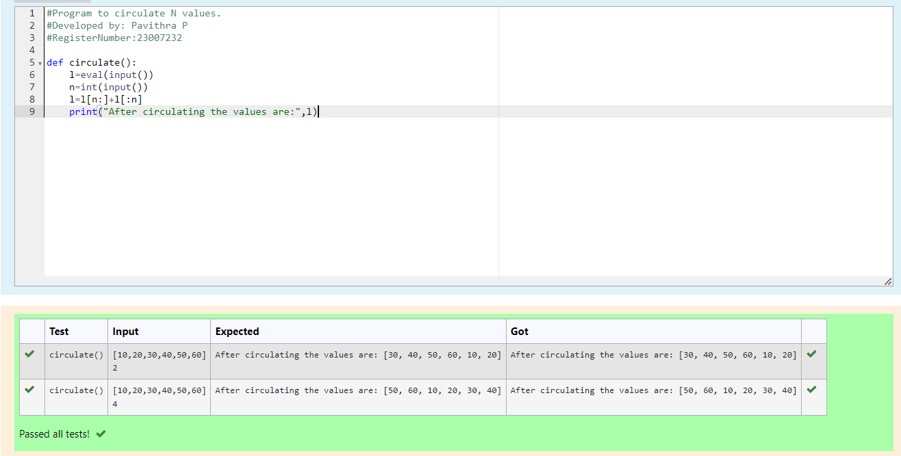

# Circulate-the-values-of-N-variables
## Aim:
To write a python program to circulate the n variables using function concept
## Equipment’s required:
PC
Anaconda - Python 3.7
## Algorithm: 
### Step 1: 
start the program.
### Step 2: 
type the function to circulate the values.
### Step 3: 
Get the value from the user for the number of rotation
### Step 4: 
Using the slicing concept rotate the list

### Step 5: 
Print the solution.
### Step 6: 
end the program.
## Program:
```PYTHON
#Program to circulate N values.
#Developed by: Pavithra P
#RegisterNumber:23007232

def circulate():
    l=eval(input())
    n=int(input())
    l=l[n:]+l[:n]
    print("After circulating the values are:",l)
```
## Output:

## Result:
Thus the values circulated successfully.